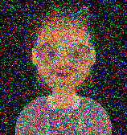
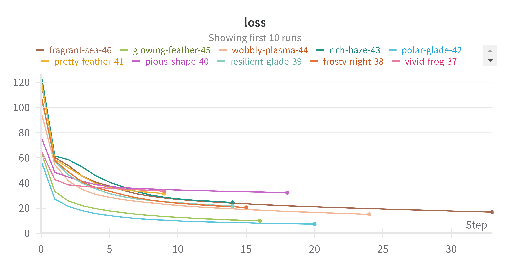

# Task 1 👔👴🧫

## Part 1. Bayesian generation (см. `Bayes_gen.ipynb`)

### Задание 1. Генерация стилей по текстовому описанию. 
Реализован класс `Stylist` (см. `stylist.py`), который принимает при инициализации список вариантов элементов стиля и список их частот.
Далее рассчитываются вероятности всех возможных комбинаций элементов стиля.
При запуске метода `suggest_style` выбирается один из стилей с соответствующей вероятностью.  
См. пример использования в `Bayes_gen.ipynb`.

### Задание 2. Генерация аватаров
Реализован класс `AvatarGenerator` (см. `avatars.py`), который принимает при инициализации путь к папке с аватарами.
При запуске метода `generate` на основе ранее поданных аватаров генерируется новое изображение. 
Значение каждого канала выбирается с вероятностью его встречаемости в обучающей выборке.  
См. пример использования в `Bayes_gen.ipynb`.  
Примеры получившихся изображений см. в `generated_images`.  

## Part 2. Autoencoders (см. `Autoencoders.ipynb`)
Реализован пайплайн поиска проливов с помощью автоэнкодеров.
Этапы работы пайплайна:
1. Модель обучается на не_проливах (`dataset\train`)
2. Сравнивается MSE (loss модели) на валидационной выборке (часть от `dataset\train`) и выборке с проливами (`dataset\proliv`).
Строится ROC AUC и подбирается оптимальное значение порога для MSE.
3. Модель и найденный порог используются для разделения проливов и не_проливов на тестовой выборке (`test\proliv`).

Эксперименты проводились с двумя архитектурами: автоэнкодер и вариационный автоэнкодер.  
Для подбора гиперпараметров используется `optuna`.  
Результат: ROC AUC на тесте: 0.89. 

Loss curves для разных экспериментов:

